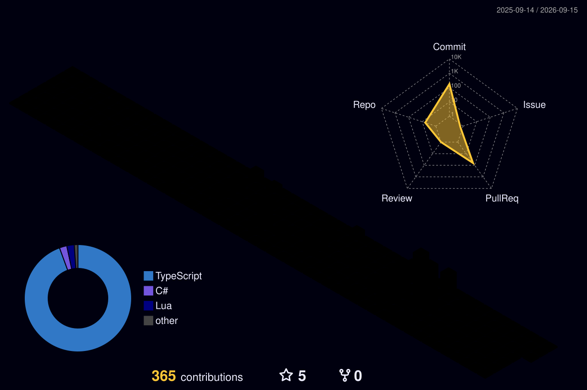

# Hey, I'm Itzplush 👋

CS student by day, builder by night.
Finishing my BS Computer Science at STI College (July 2026)
and spending most of my free time turning real problems
into actual products.

---

## What I work with

**Frontend**

**Backend & Database**

**Languages**

**Tools & Platforms**

---

## What I'm about

I don't just learn tech for the sake of it.
I learn it because I have something I want to build.

Started with game dev — C# in Unity, Lua and Luau in Roblox Studio.
Then moved into web, picked up TypeScript, Next.js, and Supabase,
and started shipping full-stack products from scratch.

Most of what I know didn't come from a classroom.
It came from building things, breaking things,
and figuring out why it broke at 2am.

---

## Currently building

A full-stack mobile-first web application with
real-time features, multi-role authentication,
file uploads, and a verification system.
Built with Next.js 14 and Supabase.

---

## GitHub Stats

---

## My Contribution Graph

---

## Let's connect

